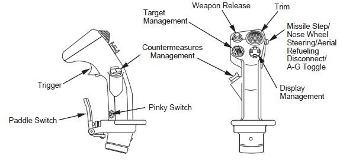

# 5. CMS – Countermeasures Management Switch

## 5.1 Concept

The Countermeasures Management Switch (CMS) is a four-way hat switch mounted on the side-stick controller. It controls the aircraft's defensive avionics:

* ALE-47 CMDS (Countermeasures Dispenser Set) — the chaff and flare dispensing system; and
* ECM (Electronic Countermeasures) — the radar-jamming system.

ECM configuration depends on block and variant: either external pods (ALQ-131/ALQ-184) or internal avionics (IDIAS).

CMS actuation procedures are presented in [Section 5.2](#52-cms-actuation) and block and variant differences in [Section 5.3](#53-block-and-variant-configurations).

For complete CMDS (including chaff and flare dispensing programs) and ECM operation, see Dash-34 §§ 2.7.1 and 2.7.2, respectively. Diagrams of the side-stick controller and throttle functions are provided in Dash-34 § 2.1.5. The figure below shows the CMS location on the F-16 side-stick controller.

_Image by Falconpedia (falcon4.wikidot.com), via [Wikimedia Commons](https://commons.wikimedia.org/wiki/File:F-16_Side_Stick_Controller.jpg), licensed under CC BY-SA 3.0._

## 5.2 CMS Actuation

The tables below cover CMS actuation organized by system: CMDS (Manual, Automatic, Semi-Automatic, Bypass, and Standby modes) and ECM (external pods ALQ-131/ALQ-184 and internal IDIAS).

All CMS actuation described in this chapter is _independent_ of the Master Mode (NAV, A-A or A-G) selected.

Table columns are defined as follows:

* **Mode**: The operational context (Master Mode).
* **Direction**: CMS hat direction (Up, Down, Left, Right).
* **Action**: Press type (Short, Long, Long Hold).
* **Function**: What the CMS command activates or controls.
* **Effect / Nuance**: Resulting system behavior, including tactics and constraints.
* **Dash34**: Reference section in the Dash-34 manual.
* **Training**: Recommended BMS training mission(s) (see the BMS Training Manual for descriptions).

### 5.2.1 CMDS

The ALE-47 CMDS operates in five modes selected via the CMDS CCU MODE knob: Manual (MAN), Automatic (AUTO), Semi-Automatic (SEMI), Bypass (BYP), and Standby (STBY).

The chaff and flare dispensing program executed in MAN, AUTO, and SEMI modes — Programs 1–4 — is selected via the PRGM knob on the CMDS panel. The PRGM knob has no effect in BYP or STBY.

Only Programs 1–4 are selectable. Programs 5 and 6 are independent of the PRGM knob position:

* Program 5 is activated via the cockpit slap switch — outside the scope of CMS — and is not covered in this guide; see Dash-34 § 2.7.2.2 for details.
* Program 6 is a special-purpose program always available for manual dispensing, independent of the PRGM knob position.

#### 5.2.1.1 Manual Mode

In Manual (MAN) mode, the pilot executes countermeasure programs (1–4 and 6) via **CMS Up** and **CMS Left**.

| Mode | Dir. | Act. | Function | Effect / Nuance | Dash34 | Train. |
| --- | --- | --- | --- | --- | --- | --- |
| CMDS MAN | Up | Short | Execute Program 1–4 | Executes the program selected via the CMDS panel PRGM knob once per press. No threat sensing; no automatic triggering. Overrides any AUTO dispensing, if running. | 2.7.2.2 | 18, 28 |
| CMDS MAN | Left | Short | Execute Program 6 | Program 6 is dispensed independently of the PRGM knob position. | 2.7.2.2 | 19 |

#### 5.2.1.2 Automatic Mode

In Automatic (AUTO) mode, the ALE-47 CMDS dispenses the selected program (1–4) _continuously_ in response to threats detected by the Radar Warning Receiver (RWR).

A **CMS Down** press grants consent for AUTO dispensing to start. It will continue until the pilot presses **CMS Right** or expendables are exhausted.

Even in AUTO mode, manual dispensing is still available.

| Mode | Dir. | Act. | Function | Effect / Nuance | Dash34 | Train. |
| --- | --- | --- | --- | --- | --- | --- |
| CMDS AUTO | Up | Short | Execute Program 1–4 | Executes the program selected via the CMDS panel PRGM knob once, interrupting any ongoing AUTO dispensing. After execution, AUTO resumes if the threat persists. | 2.7.2.2 | 18, 28 |
| CMDS AUTO | Left | Short | Execute Program 6 | Program 6 is dispensed independently of the PRGM knob position. Overrides AUTO; after execution, AUTO resumes. | 2.7.2.2 | 19 |
| CMDS AUTO | Down | Short | Give Consent; Enable AUTO Dispensing | Grants consent for AUTO dispensing. RWR-detected threats trigger automatic execution of the program (1–4) selected via the CMDS panel PRGM knob. Dispensing continues until the threat clears, the pilot presses CMS Right, or expendables are exhausted. Consent state persists if the pilot switches to MAN mode. If the pilot re-engages AUTO, dispensing resumes immediately on the next detected threat. | 2.7.2.1 | 18, 28 |
| CMDS AUTO | Right | Short | Cancel Consent; Disable AUTO | Removes CMDS consent and places the ALE-47 in Standby. Automatic dispensing halts immediately. The pilot must press CMS Down again to resume AUTO operation. | 2.7.2.1 | 18, 28 |

#### 5.2.1.3 Semi-Automatic Mode

In Semi-Automatic (SEMI) mode, the CMDS control unit displays `DISPENSE RDY` and sounds a `COUNTER` voice message every time a threat is detected. For each `COUNTER` voice message, a **CMS Down** press grants consent and the ALE-47 CMDS then dispenses _one selected program_.

Even in SEMI mode, manual dispensing is still available.

| Mode | Dir. | Act. | Function | Effect / Nuance | Dash34 | Train. |
| --- | --- | --- | --- | --- | --- | --- |
| CMDS SEMI | Up | Short | Execute Program 1–4 | Executes the program selected via the CMDS panel PRGM knob once, independent of RWR threat state. After execution, the CMDS returns to standby and resumes threat detection. | 2.7.2.2 | 18, 28 |
| CMDS SEMI | Left | Short | Execute Program 6 | Program 6 is dispensed independently of the PRGM knob position. After execution, the CMDS returns to standby and resumes threat detection. | 2.7.2.2 | 19 |
| CMDS SEMI | Down | Short | Give Consent; Dispense One Program | Dispenses one program (1–4) in response to a `COUNTER` voice message. Consent state is retained: if the pilot switches to AUTO, the CMDS begins dispensing immediately on the next detected threat. | 2.7.2.1 | 18, 28 |
| CMDS SEMI | Right | Short | Cancel Consent; Return to Standby | Removes SEMI consent and places the CMDS in Standby. `COUNTER` voice messages cease. | 2.7.2.1 | 18, 28 |

#### 5.2.1.4 Bypass and Standby Modes

In BYP and STBY, both _non-combat modes_, AUTO and SEMI dispensing are not available. Consent state is not tracked in either mode.

**Bypass (BYP):** In BYP, the CMDS program selection is bypassed: **CMS Up** dispenses _exactly_ one chaff and one flare per press. Program 6 remains available via **CMS Left**.

| Mode | Dir. | Act. | Function | Effect / Nuance | Dash34 | Train. |
| --- | --- | --- | --- | --- | --- | --- |
| CMDS BYP | Up | Short | Dispense One Chaff + One Flare | The PRGM knob setting has no effect. AUTO and SEMI dispensing are not available in BYP. | 2.7.2.1 | — |
| CMDS BYP | Left | Short | Execute Program 6 | Program 6 is dispensed independently of the PRGM knob position. | 2.7.2.2 | — |

**Standby (STBY):** In STBY, CMDS programs and bingo quantities can be edited via the UFC. This mode inhibits all chaff and flare release: _no_ CMS direction produces a dispensing effect. For program editing procedures, see Dash-34 §§ 2.7.2.1 and 2.7.2.3.

### 5.2.2 ECM

The ECM system operates in two configurations:

* External pods (ALQ-131, ALQ-184) — controlled via **CMS Down**; and
* Internal IDIAS — controlled via **CMS Left**.

#### 5.2.2.1 External ECM Pod (ALQ-131/ALQ-184)

For the external ECM pod to operate, its power switch must be in OPR. This enables the XMIT switch on the ECM control panel to set the operation mode:

* XMIT 1: Avionics Priority, AFT antenna only
* XMIT 2: ECM Priority, both FWD and AFT antennas
* XMIT 3: Active Jam, continuous transmission

After setting the operation mode, **CMS Down** grants consent for ECM pod transmission. The ECM Enable light on the left miscellaneous panel illuminates.

| Mode | Dir. | Act. | Function | Effect / Nuance | Dash34 | Train. |
| --- | --- | --- | --- | --- | --- | --- |
| ECM Pod | Down | Short | Grant ECM Consent | The pod transmits in the operation mode set by the XMIT switch. Transmission continues until the pilot presses CMS Right or the RF switch is moved out of NORM. | 2.7.4.1.1, 2.7.4.2.5 | 28 |
| ECM Pod | Right | Short | Remove ECM Consent | ECM consent is removed. The pod is placed in Standby and the ECM Enable light extinguishes. The pilot must press CMS Down again to resume transmission. | 2.7.4.1.1, 2.7.4.2.5 | 28 |

#### 5.2.2.2 Internal ECM (IDIAS)

For IDIAS to operate, its power switch must be in ON. Then, with the XMTR switch in OPER, **CMS Left** cycles the ECM operation mode.

The active operation mode is displayed on the HUD, FCR, RWR, and TFR pages.

| Mode | Dir. | Act. | Function | Effect / Nuance | Dash34 | Train. |
| --- | --- | --- | --- | --- | --- | --- |
| IDIAS ECM | Left | Short | Cycle ECM Operation Mode | The IDIAS mode advances with each short press: `STBY` → `AVNC` (Avionics Priority) → `ECM` (ECM Priority) → `AVNC` → `ECM`. | 2.7.4.1.2 | 28 |
| IDIAS ECM | Right | Short | Set ECM to Standby | IDIAS is set to `STBY`. The pilot must press **CMS Left** again to return to `AVNC` or `ECM`. | 2.7.4.1.2 | 28 |

### 5.2.3 CMDS and ECM Joint Consent

On aircraft equipped with an _external_ ECM pod, **CMS Down** grants consent to _both_ the ALE-47 CMDS and the external ECM pod. This joint consent applies to CMDS AUTO and SEMI modes _only_.

As **CMS Down** has no function on IDIAS-equipped aircraft, the joint consent does not apply.

| Mode | Dir. | Act. | Function | Effect / Nuance | Dash34 | Train. |
| --- | --- | --- | --- | --- | --- | --- |
| CMDS AUTO/SEMI + ECM Pod | Down | Short | Joint Consent (CMDS + ECM) | Simultaneous consent to CMDS and the external ECM pod. | 2.7.2.1, 2.7.4.2.5 | 18, 28 |

### 5.2.4 Constraints and Edge Cases

**State Tracking:** In CMDS AUTO and SEMI modes, consent state is _not cleared_ when MAN mode is selected. If the pilot re-engages AUTO or SEMI without pressing **CMS Down**, the CMDS begins dispensing immediately on the next detected threat. As BYP and STBY modes do not have a consent state, switching to either mode does not retain any prior consent.

**Bingo Quantity Behavior:** In AUTO mode, the CMDS continues dispensing when expendables fall to or below the bingo quantity. The pilot must press **CMS Right** to disable AUTO dispensing, or switch to MAN mode.

**RF Switch Override:** When ECM consent is active, the ECM system is placed in Standby if the RF switch is moved from NORM to QUIET or SILENT. Consent is _not_ restored when the RF switch is returned to NORM. The pilot must press **CMS Down** again to resume ECM transmission.

**Ground Safety:** On the ground, if the pilot holds **CMS Down**, the ECM pod may radiate. Ground personnel must be clear of the radiation area.

## 5.3 Block and Variant Configurations

CMS interaction with CMDS is _uniform_ across all F-16 block and variant configurations (see [Section 5.2.1](#521-cmds)).

F-16 block and variant configurations with external pod ECM, however, use _different_ CMS procedures and ECM control panels (see [Section 5.2.2](#522-ecm)):

| ECM Configuration | CMS Direction | Panel Control |
| --- | --- | --- |
| External Pod (ALQ-131/ALQ-184) | CMS Down (consent) | XMIT switch (positions: 1, 2, 3) |
| Internal IDIAS | CMS Left (mode cycling) | XMTR switch (positions: STBY, OPER) |

### 5.3.1 ECM Configurations by Block and Variant

The block and variant configurations listed in the following tables are sourced from Dash-34 documentation. Not all may be available as selectable aircraft in Falcon BMS 4.38.1.

#### 5.3.1.1 ECM Pods (ALQ-131/ALQ-184)

These block and variant configurations use the ECM Pod Control Panel with manual jamming program selection. For detailed procedures, see [Section 5.2.2.1](#5221-external-ecm-pod-alq-131alq-184).

| Operator | Block/Variant |
| --- | --- |
| USAF | Blocks 40/42/50/52 (CM designation) |
| NATO | Block 15 operators (Belgium, Denmark, Netherlands, Norway) |
| International | Egypt, Korea KF-16C Block 32 |

#### 5.3.1.2 Internal ECM (IDIAS)

These block and variant configurations use the IDIAS ECM control panel. For detailed procedures, see [Section 5.2.2.2](#5222-internal-ecm-idias).

| Operator | Block/Variant |
| --- | --- |
| Israel | F-16I Sufa Block 52, Barak I Block 30, Barak II Block 40 |
| International | Greek HAF (Blocks 50 PXII, 52 PXIII, 52+ PXIV Advanced), Korea KF-16C Block 52, Singapore F-16D Block 52 |
